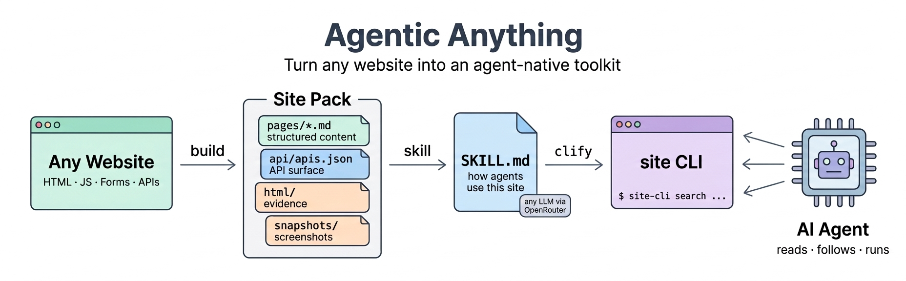

<div align="center">



# Agentic Anything

**Turn any resource into an agent-native representation — and into a resource agent you can talk to or call.**

[](LICENSE)
[](pyproject.toml)
[](tests/)

[English](README.md) | [中文](README_ZH.md)

[**Live Demo Gallery**](https://thuqixuan.github.io/agentic-anything/) ·
[reproducible demo sources and outputs](demos/)

</div>

---

Resources are built for human consumption. Agents deserve better: structured
evidence instead of pixel-parsing, explicit operations instead of interface
guesswork, and a direct agent interface instead of first learning how every
website, book, video, program, or repository is organized.

**Agentic Anything** has two inseparable goals:

1. Turn heterogeneous resources into **agent-native representations** that
   preserve their structure, evidence, provenance, actions, and capture limits.
2. Turn each representation into a **resource agent** that humans and agents can
   talk to, inspect, call through standard protocols, or use programmatically.

```
  website · PDF · book · video · data · software · repository · folder
                              │
                         agentify
                              ▼
       AGENT-NATIVE PACK                 RESOURCE AGENT
  units · structure · actions      chat · MCP · HTTP/OpenAI · A2A
  locators · hashes · frontier     SKILL.md · resource CLI · query/read
```

- **`agentify`** is the preferred one-shot path. It captures any supported
  source, writes the agent-native pack, generates `SKILL.md` and a specialized
  CLI, then adds `agent-interface.json` plus `AGENT.md` as stable machine and
  human entry points. `build` remains available when you only need the
  representation layer.

- **Heterogeneous ingestion** covers:

  | Kind | Sources |
  |---|---|
  | Websites | same-site crawl · structured manifests · **API surface** (forms, JS endpoints, OpenAPI, feeds, observed network calls) · HTML evidence · optional screenshots |
  | Papers & docs | PDF (local, **direct URL, `arxiv:<id>`**) · DOCX · EPUB · Markdown · plain text/RST/LaTeX |
  | Presentations & data | PPTX · XLSX · CSV/TSV · JSON/JSONL · Jupyter notebooks · **SQLite databases** |
  | Videos & audio | online video URLs (YouTube/Bilibili/… via `yt-dlp` subtitles) · local media (`ffmpeg` embedded subs → `whisper` transcription) · SRT/VTT |
  | Software & code | **installed CLI tools** (`build cli:git` — help/subcommands/man introspection) · **GitHub repos by URL** · local source trees |
  | Everything else | folders · zip/tar archives · RSS/Atom feeds & podcasts · email (.eml/.mbox) |

- **Resource-agent interfaces** include grounded terminal conversation
  (`chat`), read-only MCP for Codex/Claude Code and other hosts (`mcp`), an HTTP
  agent with OpenAI-compatible and optional A2A access (`serve`), deterministic
  query/read operations, `SKILL.md`, and a zero-dependency resource CLI.

The result: you can *chat with a website*, *interview a book*, *ask a video for
the relevant moment*, or *hand a software/repository agent directly to another
agent*—without first reverse-engineering the resource's native interface.

## Installation

```bash
pip install -e .                 # core: zero runtime dependencies
pip install -e '.[render]'       # + Playwright for JS rendering & screenshots
pip install -e '.[docs]'         # + pypdf for PDF ingestion
pip install -e '.[media]'        # + yt-dlp for online videos
python -m playwright install chromium
```

Optional system tools unlock more sources: `ffmpeg` (embedded subtitles in
local media), `openai-whisper` (speech-to-text). Note: YouTube may require
cookies on datacenter IPs (a yt-dlp/YouTube constraint).

Requires Python 3.10+. The core installation uses only the standard library.

## Quick start

Want to see real outputs before installing? The
[interactive demo gallery](https://thuqixuan.github.io/agentic-anything/)
uses five hash-pinned resources from Project Gutenberg, the PSF Requests
repository, Python's official documentation, NASA GISTEMP, and PubMed Central.
It shows the real source before conversion, the generated pack, and actual
search/CLI/MCP results; every claim links back to a locator and content hash.

```bash
# 1. Turn ANY resource into an agent-native pack + resource-agent interfaces
agentic-anything agentify https://quotes.toscrape.com/  -o packs/quotes
agentic-anything agentify arxiv:1706.03762              -o packs/paper
agentic-anything agentify report.pdf                    -o packs/report
agentic-anything agentify "https://youtu.be/VIDEO_ID"   -o packs/talk
agentic-anything agentify https://github.com/psf/requests -o packs/req
agentic-anything agentify cli:git                       -o packs/git
agentic-anything agentify ./my-notes/                   -o packs/notes

# Every result explains how humans and agents can use it
cat packs/report/AGENT.md
cat packs/report/agent-interface.json

# 2. Give the resource directly to Codex or Claude Code (no API key)
agentic-anything mcp-config packs/alice --client codex    # paste into .codex/config.toml
agentic-anything mcp-config packs/alice --client claude  # save as .mcp.json

# Or start the stdio MCP server yourself
agentic-anything mcp packs/alice

# 3. Chat with it (any OpenAI-compatible LLM; OpenRouter by default)
export OPENROUTER_API_KEY="sk-or-..."
agentic-anything chat packs/alice                             # interactive REPL
agentic-anything chat packs/lecture --ask "What does E42 mean?"

# 4. Host resources as agents; let them talk to each other
agentic-anything serve packs/alice packs/lecture --port 8373 --enable-a2a
curl localhost:8373/agents                                    # agent directory
curl -X POST localhost:8373/agents/alice/ask \
     -d '{"question": "According to the lecture agent, what is E42?"}'
# ...alice consults the lecture agent over the @ask protocol and answers.

# Any OpenAI client can talk to a resource agent (model = agent id):
curl -X POST localhost:8373/v1/chat/completions \
     -d '{"model": "lecture", "messages": [{"role":"user","content":"Summarize the video"}]}'

# 5. Lower-level layers remain available independently
agentic-anything build report.pdf -o packs/report-only   # representation only
agentic-anything skill packs/quotes --language both   # SKILL.md + SKILL_ZH.md
agentic-anything clify packs/quotes                   # zero-dependency resource CLI
agentic-anything pack https://books.toscrape.com/     # legacy alias for agentify
```

For JavaScript-heavy sites, add rendering and visual snapshots:

```bash
agentic-anything build https://quotes.toscrape.com/js/ -o packs/quotes-js \
    --render --screenshots
```

Rendered mode also **sniffs the network**: every XHR/fetch API call the page makes is recorded into the pack's API surface — real endpoints, observed, not guessed.

## What an agentified resource looks like

```
packs/quotes/
├── agent-pack.json          # discovery document: what's in this pack
├── agent-interface.json     # machine-readable ways to talk to/call this resource agent
├── AGENT.md                 # entry guide; no pack-layout knowledge required
├── site.json                # page index + crawl frontier (what was NOT captured, and why)
├── pages/
│   ├── index.json           # structured manifest: content, links, forms, provenance
│   └── index.md             # the same page as agent-readable markdown
├── html/index.html          # captured HTML evidence
├── snapshots/index.png      # full-page screenshots (rendered mode, optional)
├── api/apis.json            # forms · JS endpoints · OpenAPI · feeds · observed network calls
├── skills/SKILL.md          # generated usage guide for agents (+ SKILL_ZH.md)
└── cli/quotes_..._cli.py    # generated zero-dependency resource CLI
```

Design principles (inherited from the projects that inspired this one — see
[Acknowledgements](#acknowledgements)):

- **Non-visual first**: agents read markdown and JSON, not rendered pixels. Screenshots are available but opt-in.
- **Evidence preserved**: every manifest links back to captured HTML with a SHA-256; claims are verifiable.
- **Honest boundaries**: the crawl frontier records every URL that was discovered but *not* captured, with the reason (budget, robots.txt, cross-site, fetch error).
- **Agent-contract CLI**: everything supports `--json`, exit codes are meaningful, errors go to stderr.
- **Protocol-native access**: MCP tools are read-only and return unit ids, evidence, and provenance; captured resource text is treated as untrusted data, never as server instructions.
- **Multilingual retrieval**: BM25F preserves title/heading/body structure, Unicode words cover most languages, and CJK bigrams avoid the silent zero-token failure of ASCII-only search.

## CLI reference

| Command | What it does |
|---|---|
| `agentify SOURCE -o DIR` | Preferred one-shot: build the agent-native pack, SKILL, resource CLI, `agent-interface.json`, and `AGENT.md` |
| `build SOURCE -o DIR` | Build only the representation layer from a website / video / repo / arXiv / feed URL; local file; folder/repo; or `cli:<tool>` |
| `chat PACK [--ask Q]` | Converse with the pack (REPL or one-shot). Options: `--top-k`, `--model`, `--base-url`, `--peer ID=URL` (consult remote agents), `--json` |
| `serve PACK... ` | Host packs as HTTP agents. Options: `--host`, `--port`, `--enable-a2a`, `--model`, `--top-k` |
| `mcp PACK...` | Expose packs as a read-only stdio MCP server (resources + tools + prompts; no API key) |
| `mcp-config PACK...` | Print a Codex TOML or Claude Code JSON configuration (`--client codex\|claude`) |
| `skill PACK` | Generate `skills/SKILL.md`. Options: `--model`, `--base-url`, `--language en\|zh\|both`, `--no-llm` |
| `clify PACK` | Generate `cli/<site>_cli.py` + its README |
| `pack SOURCE -o DIR` | Backward-compatible alias for `agentify` |
| `query PACK "question"` | Keyword search across the pack with evidence blocks |
| `page PACK PAGE_ID [--format md\|json]` | Print one captured unit |
| `apis PACK` | Show the discovered API surface (websites) |
| `info PACK` | Pack summary |

All data-producing commands accept `--json`. `query` uses Unicode BM25F by default; `--method legacy` reproduces the v0.3 scorer. `aany` is a short alias for `agentic-anything`.

## Use a resource from Codex or Claude Code

`mcp` is the shortest path from a captured resource to an existing coding
agent. It exposes three read-only tools:

| Tool | Purpose |
|---|---|
| `resource_info` | Inspect resource type, capture boundary, capabilities, and unit ids |
| `search_resource` | Search one or all packs; returns ranked unit ids and matching evidence |
| `read_unit` | Read Markdown plus source locator and SHA-256 provenance |

The same units are also available through MCP `resources/list` / `resources/read`,
and `use_resource` is exposed as an MCP prompt. To configure Codex:

```bash
agentic-anything mcp-config packs/alice --client codex
```

Paste the printed table into `~/.codex/config.toml` or a trusted project's
`.codex/config.toml`. Codex CLI, the IDE extension, and the desktop app share
that host configuration. For Claude Code:

```bash
agentic-anything mcp-config packs/alice --client claude > .mcp.json
```

Claude Code asks for approval before using project-scoped servers. Both clients
launch the same local stdio command; no resource contents or credentials are
uploaded by Agentic Anything itself. Other MCP hosts can run
`agentic-anything mcp PACK...` directly.

## Agent server API

`serve` exposes every pack as an agent:

| Endpoint | Description |
|---|---|
| `GET /agents` | Directory of hosted agents (cards: id, type, description, peers) |
| `GET /agents/<id>/card` | One agent card |
| `POST /agents/<id>/ask` | `{"question", "history"?}` → `{"answer", "citations", "used_units", "peer_calls"}` |
| `POST /v1/chat/completions` | OpenAI-compatible; `model` = agent id; citations returned under `agentic_anything` |
| `GET /v1/models` | Hosted agents as OpenAI models |

With `--enable-a2a`, co-hosted agents may consult each other: when an agent
decides another resource holds the answer, it emits `@ask <peer> <question>`,
the engine routes it (in-process or over HTTP via `chat --peer`), and the
final answer attributes what came from which agent (`peer_calls` in the
response). Hops are budgeted to prevent loops.

## LLM configuration (OpenRouter & friends)

`chat`, `serve` and skill generation talk to any **OpenAI-compatible** chat endpoint. Defaults target [OpenRouter](https://openrouter.ai) so one key unlocks every hosted model:

| Environment variable | Default | Meaning |
|---|---|---|
| `OPENROUTER_API_KEY` | — | API key (**required** for LLM features; never stored on disk) |
| `AGENTIC_API_KEY` | — | Alternative key name; takes precedence if both are set |
| `AGENTIC_MODEL` | `google/gemini-3.5-flash` | Any model id your endpoint serves |
| `AGENTIC_BASE_URL` | `https://openrouter.ai/api/v1` | Any OpenAI-compatible server (OpenAI, vLLM, llama.cpp, LM Studio, …) |

```bash
export OPENROUTER_API_KEY="sk-or-..."
agentic-anything chat  packs/alice  --model anthropic/claude-sonnet-4.5  # pick any model
agentic-anything skill packs/quotes --no-llm                             # or no LLM at all
```

Capture (`build`), search (`query`) and the generated CLIs run **without any API key**.

## Python API

```python
from agentic_anything import (
    ResourceAgent, ResourceMCPServer, build_pack, build_pack_from_source,
    generate_agent_interface, generate_skill, generate_site_cli, search_pack,
)
from agentic_anything.config import BuildConfig, LLMConfig

# agentify a website ...
build_pack("https://quotes.toscrape.com/", "packs/quotes",
           config=BuildConfig(max_pages=10))
# ... or anything else
build_pack_from_source("alice.txt", "packs/alice")
generate_agent_interface("packs/alice")  # agent-interface.json + AGENT.md

# chat with it
agent = ResourceAgent("packs/alice", LLMConfig.from_env())
reply = agent.ask("How does Alice enter the rabbit hole?")
print(reply.answer, reply.citations)

# host agents programmatically
from agentic_anything.server import AgentServer
server = AgentServer(["packs/alice", "packs/quotes"], LLMConfig.from_env(),
                     port=8373, enable_a2a=True)
server.serve_forever()

# or embed the protocol adapter (handle one decoded JSON-RPC message)
mcp = ResourceMCPServer(["packs/alice"])
print(mcp.handle({"jsonrpc": "2.0", "id": 1, "method": "tools/list"}))
```

## Testing

```bash
pip install -e '.[dev]'
python -m pytest tests -q        # 170 tests; rendered-mode tests auto-skip without Playwright
```

The suite covers heterogeneous ingestion, pack construction, the generated
resource-agent interface contract, Unicode/BM25F retrieval, MCP
lifecycle/resources/tools/prompts and stdout purity, conversational and HTTP
agents, skills, resource CLIs, and the LLM client. No unit test calls an
external service or model. Reproducible retrieval and host-compatibility
evaluations live in [`benchmarks/`](benchmarks/).

## Responsible use

- robots.txt is respected by default (`--ignore-robots` exists for sites you own).
- Crawling is same-site and budget-limited by default.
- The generated site CLI's `fetch` command is restricted to same-origin GETs.
- Review a site's terms of service before building packs of it, and before letting agents call its endpoints.

## Acknowledgements

Agentic Anything stands on ideas from:

- [CLI-Anything](https://github.com/HKUDS/CLI-Anything) — the SKILL.md contract, `--json`-everywhere CLI conventions, and the "make software agent-native" thesis.
- **web-anything** — evidence-preserving site bundles, crawl frontiers, and non-visual page manifests.
- [AutoFigure-Edit](https://github.com/ResearAI/AutoFigure-Edit) — used to generate the banner figure.

## License

[MIT](LICENSE)
