<div align="center">

# Agentic Anything

**把任何资源变成 Agent 原生表示，再变成可以直接对话和调用的资源 Agent。**

[](LICENSE)
[](pyproject.toml)
[](tests/)

[English](README.md) | [中文](README_ZH.md)



[**在线 Demo 展示**](https://thuqixuan.github.io/agentic-anything/) ·
[录制的运行、来源与重建脚本](demos/)

</div>

---

网站、书籍、视频、软件和代码仓库都是按人类的使用方式组织的。Agent 需要的
是结构化证据、明确操作和一个直接可用的 Agent 接口，而不是每遇到一种资源
就重新学习它的页面、菜单、文件层级或命令体系。

**Agentic Anything** 有两条不可分割的主线：

1. 把异构资源转成保留结构、证据、溯源、动作与抓取边界的
   **Agent 原生表示**；
2. 把每份表示转成一个**资源 Agent**，让人类和其他 Agent 可以直接对话、
   检索、通过标准协议调用或以程序方式使用，而不必先理解资源内部组织。

```
  网站 · PDF · 书籍 · 视频 · 数据 · 软件 · 代码仓库 · 文件夹
                              │
                          agentify
                              ▼
         AGENT 原生 PACK                   资源 AGENT
   单元 · 结构 · 动作 · 溯源       chat · MCP · HTTP/OpenAI · A2A
   定位 · 哈希 · 抓取边界           SKILL.md · 资源 CLI · query/read
```

- **`agentify`** 是首选的一站式入口：抓取任意受支持来源，生成 Agent 原生
  pack、`SKILL.md` 和资源专用 CLI，再写出机器可读的
  `agent-interface.json` 与人/Agent 可读的 `AGENT.md`。只需要表示层时仍可
  单独使用 `build`。

- **深捕获**把页面链接的*附件*一并收进同一个 pack：课程页链接的讲义
  PDF、数据集、GitHub 起步仓库都变成与网页平级、可被引用的单元；而没有
  跟进的部分（更多 PDF、视频、死链）会带着原因记录在 frontier 里，绝不
  静默消失。一个课程 URL 就变成一个课程 Agent。见
  [深捕获](#深捕获跟进页面链接的附件)。

- **异构资源摄入**覆盖：

  | 类别 | 来源 |
  |---|---|
  | 网站 | 同站爬取 · 结构化 manifest · **API 面清单**（表单、JS 接口、OpenAPI、feed、网络观测）· HTML 证据 · 可选截图 · **深捕获链接的文档与仓库** |
  | 论文与文档 | PDF（本地、**直链 URL、`arxiv:<id>`**）· DOCX · EPUB · Markdown · 纯文本/RST/LaTeX |
  | 演示与数据 | PPTX · XLSX · CSV/TSV · JSON/JSONL · Jupyter 笔记本 · **SQLite 数据库** |
  | 音视频 | 在线视频 URL（YouTube/B站等，yt-dlp 拉字幕）· 本地音视频（ffmpeg 抽内嵌字幕 → whisper 转写）· SRT/VTT，**逐句时间戳** |
  | 软件与代码 | **已安装的 CLI 软件**（`build cli:git`，help/子命令/man 自省）· **GitHub 仓库 URL** · 本地代码树 |
  | 其他 | 文件夹 · zip/tar 压缩包 · RSS/Atom 订阅与播客 · 邮件（.eml/.mbox） |

- **资源 Agent 接口**包括：有引用的终端对话（`chat`）、面向 Codex、
  Claude Code 等 host 的只读 MCP（`mcp`）、兼容 OpenAI 且可选 A2A 的
  HTTP Agent（`serve`）、确定性 query/read、`SKILL.md` 和零依赖资源 CLI。

最终效果：你可以*和网站聊天*、*采访一本书*、*询问视频里的相关时刻*，
也可以把软件或代码仓库的资源 Agent 直接交给另一个 Agent——不必先逆向
理解资源原生接口。

## 安装

```bash
pip install -e .                 # 核心：零运行时依赖
pip install -e '.[render]'       # + Playwright，支持 JS 渲染和截图
pip install -e '.[docs]'         # + pypdf，支持 PDF 摄入
pip install -e '.[media]'        # + yt-dlp，支持在线视频
python -m playwright install chromium
```

可选系统工具解锁更多来源：`ffmpeg`（本地媒体内嵌字幕）、`openai-whisper`
（语音转写）。注意：数据中心 IP 访问 YouTube 可能被要求 cookies（yt-dlp/
YouTube 的上游限制）。

需要 Python 3.10+。核心安装只用标准库。

## 先看效果

[**Demo gallery**](https://thuqixuan.github.io/agentic-anything/) 回放的是
录制好、可校验的真实会话——没有任何 mockup：

- 🎓 **一个课程 URL → 一个课程 Agent。** 斯坦福 CS336 的课程页连同 6 份
  讲义 PDF、作业起步仓库被深捕获进同一个 pack。三段真实模型对话录制回答
  "RoPE 在哪几页 slides"，甚至绕过了 pack 如实记录的死链找到改名后的作业
  讲义。旁边还有一条 14 步的确定性 agent run。
- 🎬 **一个素材文件夹 → 一个剪辑 Agent。** 三部 CC-BY Blender 开源电影的
  字幕变成可按台词检索的素材库；录制的 run 输出帧级精确的预告片剪辑清单，
  附可执行 ffmpeg 命令和逐片署名。
- 📦📖🐍📊📄 **另外五种资源形态**（代码仓库、整本书、文档站、NASA 数据集、
  学术论文），外加一条真实 GPT-4.1-mini 通过 stdio MCP 完成的 21 步工具
  循环（驳回过程原样保留）。

页面上的一切都来自仓库中已提交的录制数据；74/74 项离线 run 校验和每条
录制引用都会在 CI 里重新验证。

## 快速开始

```bash
# 0. 旗舰动作：一个课程 URL → 一个课程 Agent
agentic-anything agentify https://cs336.stanford.edu/spring2025/ \
    --follow-docs 6 --follow-repos 1 -o packs/cs336-course
agentic-anything chat packs/cs336-course \
    --ask "RoPE 在哪个 lecture 的哪几页 slides？"

# 1. 把任何资源变成 Agent 原生 pack + 资源 Agent 接口
agentic-anything agentify https://quotes.toscrape.com/  -o packs/quotes
agentic-anything agentify arxiv:1706.03762              -o packs/paper
agentic-anything agentify report.pdf                    -o packs/report
agentic-anything agentify "https://youtu.be/VIDEO_ID"   -o packs/talk
agentic-anything agentify https://github.com/psf/requests -o packs/req
agentic-anything agentify cli:git                       -o packs/git
agentic-anything agentify ./my-notes/                   -o packs/notes

# 每个结果都会说明人类和 Agent 应如何直接使用它
cat packs/report/AGENT.md
cat packs/report/agent-interface.json

# 2. 直接交给 Codex 或 Claude Code（不需要 API key）
agentic-anything mcp-config packs/alice --client codex    # 粘贴到 .codex/config.toml
agentic-anything mcp-config packs/alice --client claude  # 保存为 .mcp.json
agentic-anything mcp packs/alice                          # 或直接启动 stdio MCP

# 3. 和它聊天（任何 OpenAI 兼容 LLM，默认 OpenRouter）
export OPENROUTER_API_KEY="sk-or-..."
agentic-anything chat packs/alice                             # 交互式 REPL
agentic-anything chat packs/lecture --ask "错误码 E42 是什么意思？"

# 4. 把资源托管成 Agent，让它们互相对话
agentic-anything serve packs/alice packs/lecture --port 8373 --enable-a2a
curl localhost:8373/agents                                    # agent 目录
curl -X POST localhost:8373/agents/alice/ask \
     -d '{"question": "根据 lecture agent，E42 是什么？"}'
# ……alice 会通过 @ask 协议咨询 lecture agent 再回答你。

# 任何 OpenAI 客户端都能把资源 agent 当模型用（model = agent id）：
curl -X POST localhost:8373/v1/chat/completions \
     -d '{"model": "lecture", "messages": [{"role":"user","content":"总结这个视频"}]}'

# 5. 也可以独立使用底层能力
agentic-anything build report.pdf -o packs/report-only   # 只生成表示层
agentic-anything skill packs/quotes --language both   # 中英双语 SKILL
agentic-anything clify packs/quotes                   # 零依赖资源 CLI
agentic-anything pack https://books.toscrape.com/     # agentify 的兼容别名
```

对 JavaScript 重的网站，打开渲染和视觉快照：

```bash
agentic-anything build https://quotes.toscrape.com/js/ -o packs/quotes-js \
    --render --screenshots
```

渲染模式还会**嗅探网络**：页面发出的每个 XHR/fetch API 调用都会被记录进 pack 的 API 面清单 —— 接口是真实观测到的，不是猜的。

## 深捕获：跟进页面链接的附件

网页往往只是一个*枢纽*：课程页链接着讲义 PDF、起步仓库和视频，项目页链接
着手册和发布包。只做同站爬取会拿到枢纽、丢掉知识。深捕获把附件收进同一个
pack：

```bash
agentic-anything agentify https://cs336.stanford.edu/spring2025/ \
    --follow-docs 6 --follow-repos 1
```

| 选项 | 含义 |
|---|---|
| `--follow-docs N` | 最多摄入 N 个链接的文档（PDF/DOCX/PPTX/XLSX/EPUB/CSV/TSV/ipynb/MD/SRT/VTT、zip/tar 压缩包），走对应的摄入器 |
| `--follow-repos N` | 最多摄入 N 个链接的 GitHub 仓库（codeload zip 导出 → 目录树 + 逐文件单元） |
| `--follow-host HOST` | 额外允许从 HOST 下载（可重复）。同站与 github.com 系始终允许 |
| `--follow-max-mb MB` | 单附件下载上限（默认 30） |

捕获始终遵守的诚实规则：

- 每个跟进的附件都记录**下载溯源**：原始链接、实际抓取 URL（GitHub blob →
  `raw.githubusercontent.com`，仓库 → codeload）、SHA-256、字节数、来源页
  面和锚文本。汇总在 `site.json → attachments`。
- 附件单元是**一等页面**：检索、`chat`、MCP、`serve`、SKILL 和资源 CLI
  对一个讲义 slides 单元（`pages 25-32`）与对一个爬取网页完全一致。
- **没有静默消失。** 超出预算、主机不允许或下载失败的链接都进 frontier，
  原因分别是 `attachment_budget_exhausted` / `attachment_not_followed` /
  `attachment_host_not_allowed` / `attachment_fetch_failed:*`；视频链接只
  记录（`video_link_recorded`），从不下载。
- 仓库树会列出**文本捕获边界之外**的文件（二进制、PDF）及大小——demo 里
  课程 Agent 正是靠这个证明"404 的作业讲义"其实还在仓库里，只是改了名。

## Agent 化后的资源长什么样

```
packs/cs336-course/
├── agent-pack.json          # 发现文档：这个 pack 里有什么
├── agent-interface.json     # 机器可读：如何对话和调用这个资源 Agent
├── AGENT.md                 # 入口指南；无需先理解 pack 文件布局
├── site.json                # 页面索引 · 附件清单（含哈希）· 爬取边界
├── pages/
│   ├── spring2025.json      # 结构化清单：内容、链接、表单、溯源信息
│   ├── spring2025.md        # 同一页面的 Markdown 视图
│   ├── 2025-lecture-3-architecture__004__pages-25-32.md   # 深捕获的 PDF 单元
│   └── stanford-cs336-assignment1-basics__file__readme-md.md  # 深捕获的仓库单元
├── html/spring2025.html     # 抓取的 HTML 证据
├── snapshots/…png           # 整页截图（渲染模式，可选）
├── api/apis.json            # 表单 · JS 接口 · OpenAPI · feed · 观测到的网络请求
├── skills/SKILL.md          # 生成的 Agent 使用指南（+ SKILL_ZH.md）
└── cli/cs336_course_cli.py  # 生成的零依赖资源 CLI
```

设计原则（继承自启发本项目的几个前辈项目，见[致谢](#致谢)）：

<div align="center"></div>

- **非视觉优先**：Agent 读 Markdown 和 JSON，不解析渲染像素。截图可用但需显式开启。
- **证据保全**：每个清单都用 SHA-256 链接回抓取的 HTML，结论可验证。
- **诚实的边界**：爬取边界记录每个被发现但*没有*抓取的 URL 及原因（预算、robots.txt、跨站、请求失败）。
- **Agent 契约式 CLI**：所有命令支持 `--json`，退出码有意义，错误走 stderr。
- **协议原生访问**：MCP 工具全部只读，返回单元 id、证据与溯源；抓取到的资源文本只当作不可信数据，不当作服务指令。
- **多语言检索**：BM25F 保留标题/小节/正文结构，Unicode word 覆盖多数语言，CJK 双字特征避免 ASCII-only 检索静默失败。

## CLI 参考

| 命令 | 作用 |
|---|---|
| `agentify SOURCE -o DIR` | 首选一站式入口：生成 Agent 原生 pack、SKILL、资源 CLI、`agent-interface.json` 和 `AGENT.md` |
| `build SOURCE -o DIR` | 只生成表示层；支持网站、视频、仓库、arXiv/feed URL、本地文件、文件夹/代码库和 `cli:<软件名>`。网站构建支持深捕获：`--follow-docs N`、`--follow-repos N`、`--follow-host H`、`--follow-max-mb MB` |
| `chat PACK [--ask 问题]` | 与 pack 对话（REPL 或一次性）。选项：`--top-k`、`--model`、`--base-url`、`--peer ID=URL`（咨询远端 agent）、`--json` |
| `serve PACK...` | 把 pack 托管为 HTTP Agent。选项：`--host`、`--port`、`--enable-a2a`、`--model`、`--top-k` |
| `mcp PACK...` | 以只读 stdio MCP 暴露 pack（resources + tools + prompts；不需要 API key） |
| `mcp-config PACK...` | 输出 Codex TOML 或 Claude Code JSON 配置（`--client codex\|claude`） |
| `skill PACK` | 生成 `skills/SKILL.md`。选项：`--model`、`--base-url`、`--language en\|zh\|both`、`--no-llm` |
| `clify PACK` | 生成 `cli/<site>_cli.py` 和配套 README |
| `pack SOURCE -o DIR` | `agentify` 的向后兼容别名 |
| `query PACK "问题"` | 关键词搜索整个 pack，带证据片段 |
| `page PACK PAGE_ID [--format md\|json]` | 打印某个单元 |
| `apis PACK` | 展示发现的 API 面（网站类） |
| `info PACK` | pack 概要 |

所有产出数据的命令都接受 `--json`。`query` 默认使用 Unicode BM25F；`--method legacy` 可复现 v0.3 检索器。`aany` 是 `agentic-anything` 的短别名。

## 在 Codex 或 Claude Code 中使用资源

`mcp` 是把已抓取资源接入现有编程 Agent 的最短路径。它提供三个只读工具：

| 工具 | 作用 |
|---|---|
| `resource_info` | 查看资源类型、抓取边界、能力和单元 id |
| `search_resource` | 搜索一个或全部 pack，返回排序单元与匹配证据 |
| `read_unit` | 读取 Markdown、源定位和 SHA-256 溯源 |

同一批单元也通过 MCP `resources/list` / `resources/read` 暴露，并提供
`use_resource` prompt。配置 Codex：

```bash
agentic-anything mcp-config packs/alice --client codex
```

把输出粘贴进 `~/.codex/config.toml`，或可信项目的 `.codex/config.toml`。
同一主机上的 Codex CLI、IDE 扩展和桌面端共享该配置。配置 Claude Code：

```bash
agentic-anything mcp-config packs/alice --client claude > .mcp.json
```

Claude Code 会在首次使用项目级 MCP 前请求确认。两者都启动同一个本地
stdio 命令；Agentic Anything 本身不会上传资源内容或凭证。其他 MCP host
也可直接运行 `agentic-anything mcp PACK...`。

## Agent 服务器 API

`serve` 把每个 pack 暴露为一个 Agent：

| 端点 | 说明 |
|---|---|
| `GET /agents` | 托管 agent 目录（卡片：id、类型、描述、peers） |
| `GET /agents/<id>/card` | 单个 agent 卡片 |
| `POST /agents/<id>/ask` | `{"question", "history"?}` → `{"answer", "citations", "used_units", "peer_calls"}` |
| `POST /v1/chat/completions` | OpenAI 兼容；`model` = agent id；引用在 `agentic_anything` 字段返回 |
| `GET /v1/models` | 托管 agent 以 OpenAI 模型形式列出 |

开启 `--enable-a2a` 后，同服 agent 可互相咨询：当某个 agent 判断答案在另一个
资源里，它会发出 `@ask <peer> <问题>`，引擎负责路由（同进程直连，或经
`chat --peer` 跨服务器 HTTP），最终回答会注明哪部分来自哪个 agent
（响应里的 `peer_calls`）。跳数有预算，防止循环。

## LLM 配置（OpenRouter 及任意兼容端点）

`chat`、`serve` 和技能生成走任何 **OpenAI 兼容**的 chat 接口。默认指向 [OpenRouter](https://openrouter.ai)，一个 key 就能调用所有托管模型：

| 环境变量 | 默认值 | 含义 |
|---|---|---|
| `OPENROUTER_API_KEY` | — | API key（LLM 功能**必需**；不会写入磁盘） |
| `AGENTIC_API_KEY` | — | 备选 key 名；两者都设置时优先生效 |
| `AGENTIC_MODEL` | `google/gemini-3.5-flash` | 你的端点支持的任意模型 id |
| `AGENTIC_BASE_URL` | `https://openrouter.ai/api/v1` | 任何 OpenAI 兼容服务（OpenAI、vLLM、llama.cpp、LM Studio 等） |

```bash
export OPENROUTER_API_KEY="sk-or-..."
agentic-anything chat  packs/alice  --model anthropic/claude-sonnet-4.5  # 任选模型
agentic-anything skill packs/quotes --no-llm                             # 或完全不用 LLM
```

抓取（`build`）、检索（`query`）和生成的 CLI **都不需要 API key**。

## Python API

```python
from agentic_anything import (
    ResourceAgent, ResourceMCPServer, build_pack, build_pack_from_source,
    generate_agent_interface, generate_skill, generate_site_cli, search_pack,
)
from agentic_anything.config import BuildConfig, LLMConfig

# Agent 化网站……
build_pack("https://quotes.toscrape.com/", "packs/quotes",
           config=BuildConfig(max_pages=10))
# ……或任何其他资源
build_pack_from_source("alice.txt", "packs/alice")
generate_agent_interface("packs/alice")  # agent-interface.json + AGENT.md

# 与之对话
agent = ResourceAgent("packs/alice", LLMConfig.from_env())
reply = agent.ask("爱丽丝是怎么进入兔子洞的？")
print(reply.answer, reply.citations)

# 编程方式托管 agent
from agentic_anything.server import AgentServer
server = AgentServer(["packs/alice", "packs/quotes"], LLMConfig.from_env(),
                     port=8373, enable_a2a=True)
server.serve_forever()

# 或直接嵌入协议适配器（处理一个已解码 JSON-RPC 消息）
mcp = ResourceMCPServer(["packs/alice"])
print(mcp.handle({"jsonrpc": "2.0", "id": 1, "method": "tools/list"}))
```

## 测试

```bash
pip install -e '.[dev]'
python -m pytest tests -q        # 178 个测试；未装 Playwright 时渲染测试自动跳过
```

测试覆盖：异构资源摄入、深捕获（跟进文档与仓库、frontier 纪律、主机白名
单）、pack 构建、生成的资源 Agent 接口契约、
Unicode/BM25F 检索、MCP 生命周期/resources/tools/prompts 与 stdout 纯净性、
对话与 HTTP Agent、技能、资源 CLI 和 LLM 客户端。单元测试不调用任何外部
服务或模型。可复现检索与 host 兼容性评估位于 [`benchmarks/`](benchmarks/)；
demo 流水线（`demos/build_demos.py` → `build_agent_runs.py` →
`build_gallery_data.py` → `verify_demos.py`）在 CI 里字节级一致地重建。

## 负责任地使用

- 默认遵守 robots.txt（`--ignore-robots` 仅用于你自己的网站）。
- 默认只爬同站、且有页面预算上限。
- 深捕获下载是定点的单次抓取（等价于用户点击链接），受预算和体积上限约
  束，仅限同站 + github.com + 显式允许的主机，且对实际抓取的 URL 做
  robots 检查。爬取过程从不下载视频。
- 生成的站点 CLI 的 `fetch` 命令仅限同源 GET。
- 在为网站构建 pack、以及让 Agent 调用其接口之前，请先确认目标网站的服务条款。

## 致谢

Agentic Anything 站在这些项目的肩膀上：

- [CLI-Anything](https://github.com/HKUDS/CLI-Anything) —— SKILL.md 契约、`--json` 全覆盖的 CLI 规范，以及"让所有软件 Agent 原生化"的理念。
- **web-anything** —— 证据保全的站点 bundle、爬取边界、非视觉页面清单。
- [AutoFigure-Edit](https://github.com/ResearAI/AutoFigure-Edit) —— 用于生成头图。

## 许可证

[MIT](LICENSE)
